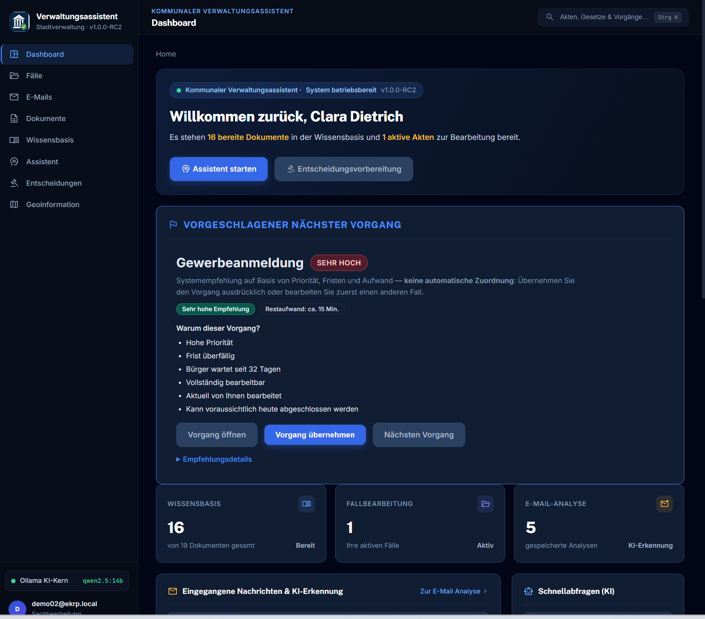
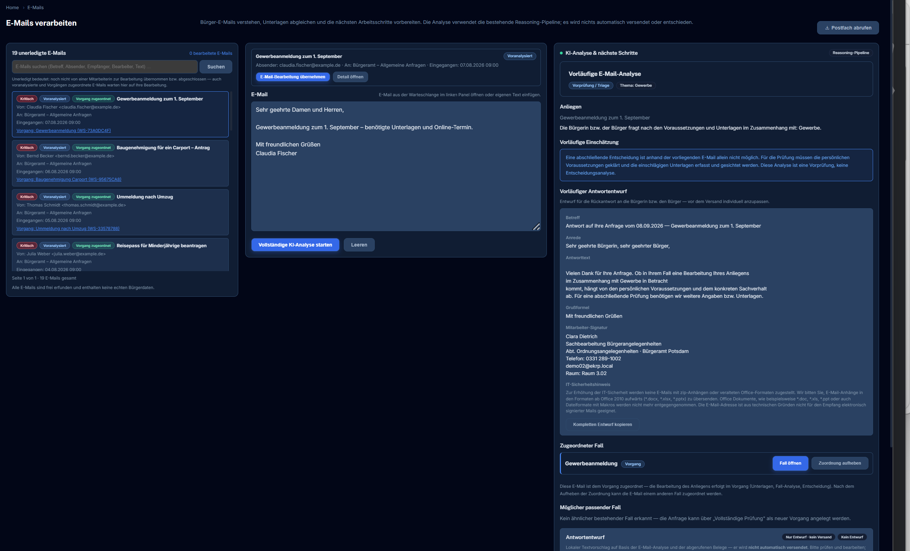
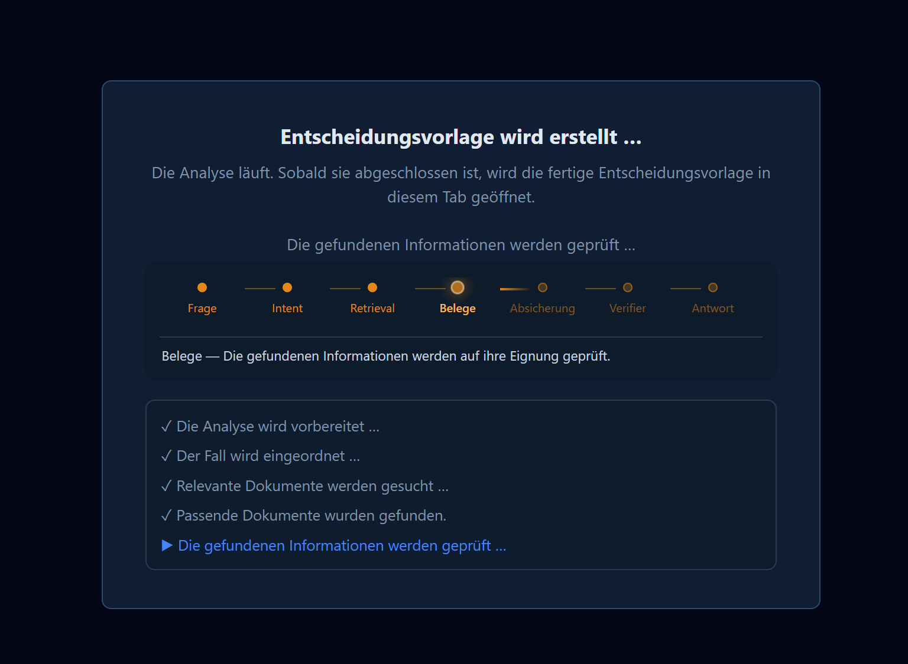
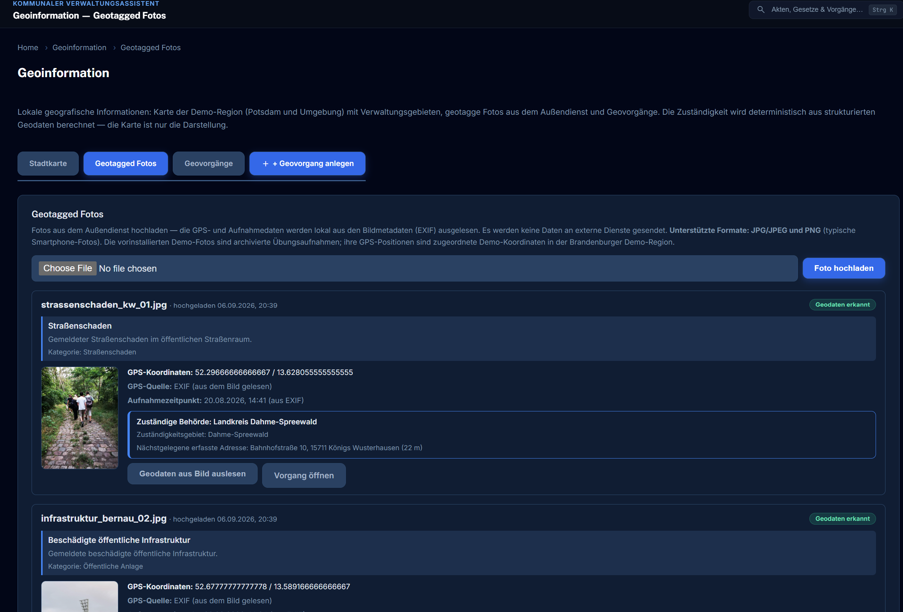
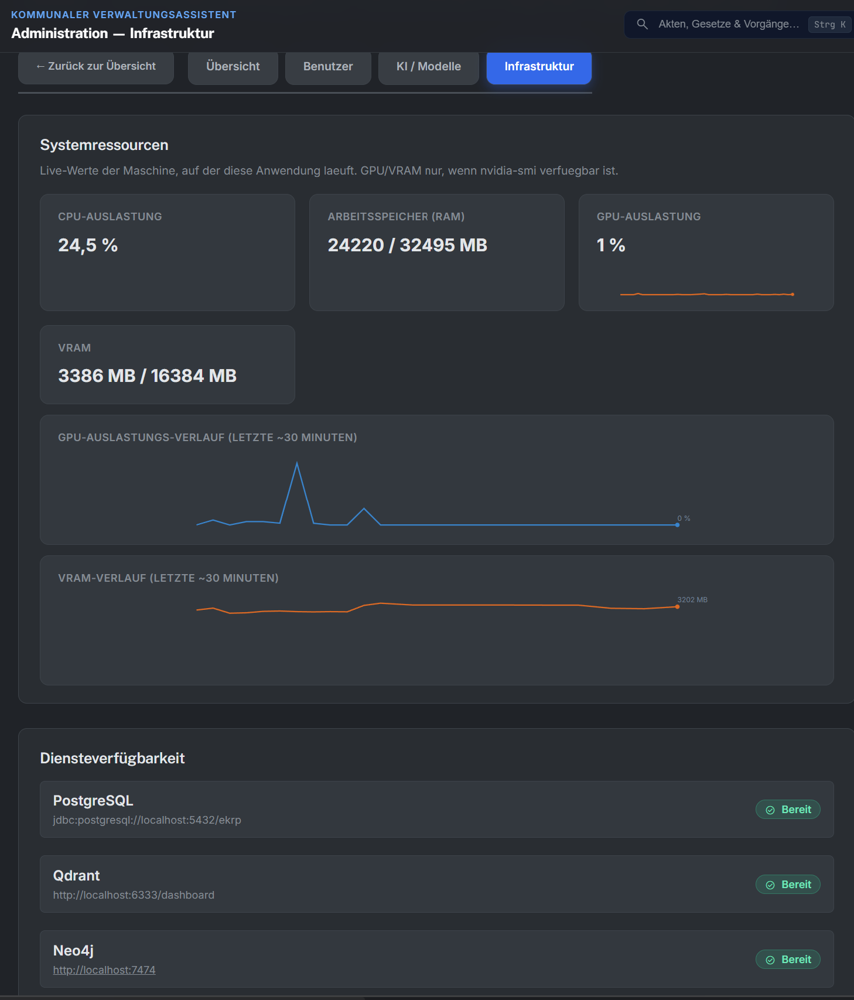

# Verwaltungsassistent

**Open-Source-System für fallbezogene Entscheidungsunterstützung in der öffentlichen Verwaltung.**

AI-supported casework for municipal administration — e-mail intake, evidence-based decision support, and answers grounded in the official knowledge base. The system takes a Vorgang/Fall, gathers the relevant regulations and documents from the municipality's own knowledge base, and prepares a traceable, evidence-based decision — every statement with its source, or an explicit "insufficient evidence" instead of a guess.

The Verwaltungsassistent runs on the Verwaltungsassistent platform (Enterprise Knowledge Reasoning Platform): semantic retrieval, deterministic rule evaluation, and verifiable reasoning over the municipality's own document corpus — statutes, service regulations, procedures and internal guidelines.

**Java 21 · Spring Boot 3.3 · Thymeleaf + HTMX · PostgreSQL · Qdrant · Neo4j · Ollama**

---

## Screenshots

| Dashboard — incoming cases and workload overview |
|---|
|  |

| E-mail inbox with AI intake analysis |
|---|
|  |

| Decision support — analysis progress over the case documents |
|---|
|  |

| Geo case management — location, photos and jurisdiction |
|---|
|  |

| Administration — AI/GPU status and maintenance |
|---|
|  |

---

## What it does

- **E-mail intake** — incoming citizen e-mails are picked up, semantically matched to running cases, triaged and turned into Vorgänge (cases).
- **Case processing** — guided workflow (Eingang → Analyse → Prüfung → Entscheidung → Abschluss) with checklists, notes, deadlines and a full audit trail.
- **Decision support** — the analysis runs the municipality's documents against the case, verifies every claim against the retrieved evidence, computes confidence, and exports an Entscheidungsvorlage (decision memo) as PDF with citations.
- **Knowledge assistant** — question answering over the ingested corpus (laws, service descriptions, internal rules), every answer with source references — or an honest "insufficient evidence".
- **Geo cases** — map-based case register with photos, Berlin district boundaries (ALKIS), address search and jurisdiction routing.
- **Administration** — users and roles, document corpus, indexing jobs, audit log, backup/restore of the complete demo state.
- **Fully German UI** — built for Bürgeramt workflows.

<h3><a href="docs/technical-whitepaper-retrieval-and-reasoning.pdf" target="_blank" rel="noopener"><strong>Technical White Paper (PDF): Retrieval, Verification and the Answer Boundary →</strong></a></h3>

How the pipeline works end to end — hybrid retrieval, the deterministic evidence gate, the independent claim verifier and the fail-closed answer boundary, with diagrams and worked examples.

---

## Installation

The installation is Docker-based and self-contained: the stack brings up the application, PostgreSQL, Qdrant, Neo4j and Ollama (including the AI models), and restores the bundled demo data set.

| Platform | Guide |
|---|---|
| **Cloud/Ubuntu 22.04 (Linux)** | [README-installation-linux.md](README-installation-linux.md) |
| **Windows (local)** | [README-installation-windows-local.md](README-installation-windows-local.md) |

Quick version (Linux, from an extracted repository ZIP):

```bash
bash deploy/install-linux.sh
```

Quick version (Windows, from an extracted repository ZIP):

```bat
deploy\install-windows.bat
```

> Download the repository as ZIP (GitHub **Code → Download ZIP**) or clone it, then run the
> install script from the extracted folder.

### Demo sign-in

| Account | Password | Role |
|---|---|---|
| `admin@verwaltungsassistent.local` | `admin123` | ADMIN — oversight |
| `superadmin@verwaltungsassistent.local` | `NcDn++2026$$` | ADMIN + SUPERADMIN — maintenance (hidden account) |
| `user@verwaltungsassistent.local` | `user1234` | USER — caseworker |
| `demo01@verwaltungsassistent.local` … `demo20@verwaltungsassistent.local` | `demo1234` | Demo staff accounts |

---

## Repository layout

```
compose.yaml               self-contained installation stack (app + databases + Ollama)
Dockerfile                 multi-stage build of verwaltungsassistent-web
deploy/                    install & restore scripts, bundled demo data and dataset
  install-linux.sh         one-shot installation on Ubuntu
  install-windows.bat      one-shot installation on Windows (Docker Desktop)
  restore-demo-data.sh/.bat  restores the bundled demo state (DB, graph, vectors, files)
  demo-data/               bundled backup of the fully prepared demo state
  demo-dataset/            demo source data set (documents, e-mails, attachments, geo photos)
verwaltungsassistent-web/  the application (Spring Boot, Thymeleaf)
platform-*/                Verwaltungsassistent platform modules (retrieval, verification, workspace, …)
docs/                      architecture, deployment and product documentation
docker-compose*.yml        legacy local development stack (host-run app, Maven)
```

## Architecture (short version)

```
Browser (German UI, Thymeleaf + HTMX)
   │
verwaltungsassistent-web        workflow, dashboards, PDF export, admin
   │
platform-* modules              document ingestion · hybrid retrieval (keyword + vector)
                                · verification · workspace/case model · audit
   │
PostgreSQL │ Qdrant │ Neo4j │ Ollama
(cases, docs, │ vectors │ graph  │ LLM + embeddings
 e-mails)     │         │        │
```

The **verifier** is the safety boundary: every generated claim is checked against the retrieved evidence — answers without sufficient support are refused instead of fabricated (see `docs/`).

---

## Documentation

| Document | Purpose |
|---|---|
| [Installation — Linux](README-installation-linux.md) | Cloud Ubuntu installation guide |
| [Installation — Windows](README-installation-windows-local.md) | Local Windows installation guide |
| [Technical White Paper](docs/technical-whitepaper-retrieval-and-reasoning.pdf) | Retrieval, verification and answer-boundary architecture |
| [Structured Knowledge](architecture/structured-knowledge-closure.md) | Rule/threshold extraction pipeline |
| [Security Architecture](docs/security/Sicherheitsarchitektur.md) | Security and deployment architecture |
| [UI Pattern Library](docs/ui/UI_PATTERN_LIBRARY.md) | UI building blocks and conventions |
| [VM appliance deployment](docs/deployer/VM_DEPLOYMENT.md) | Optional VM-based appliance installation |
| [CHANGELOG](CHANGELOG.md) | Change log |

## Development (without Docker)

```bash
# Infrastructure only (PostgreSQL, Qdrant, Neo4j) — legacy dev stack
docker compose -f docker-compose.yml up -d postgres
docker compose -f docker-compose-prod.yml up -d qdrant neo4j

# Run the app on the host (needs Java 21, Maven, Ollama)
cd verwaltungsassistent-web
mvn spring-boot:run -Dspring-boot.run.profiles=demo      # http://localhost:8081
```

Windows convenience script for the full local demo: `start-demo.bat`.

## License

[Apache License 2.0](LICENSE)
